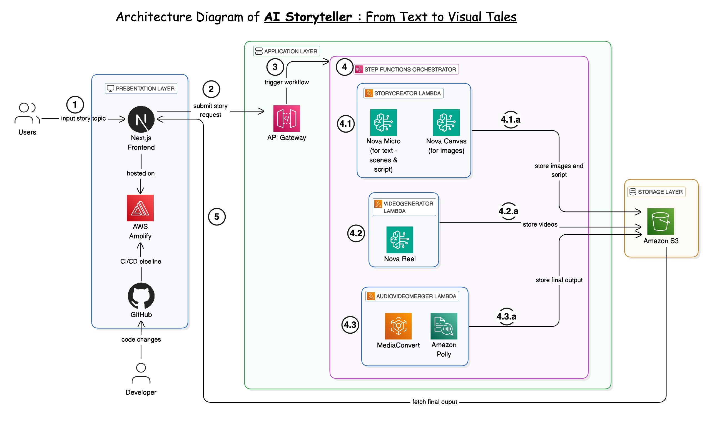

# AI Story Teller: From Text to Visual Tales

AI Story Teller is an innovative application that transforms text prompts into engaging visual stories. With just a few words, users can generate captivating videos complete with narration, bringing their ideas to life.

## Table of Contents
- [Overview](#overview)
- [Business Value](#business-value)
- [Technical Architecture](#technical-architecture)
- [Project Structure](#project-structure)
- [Getting Started](#getting-started)
  - [Prerequisites](#prerequisites)
  - [Running the Frontend Locally](#running-the-frontend-locally)
- [Deployment](#deployment)
  - [Deploying the Frontend on AWS Amplify](#deploying-the-frontend-on-aws-amplify)
  - [Deploying the Backend with AWS SAM](#deploying-the-backend-with-aws-sam)
- [Usage](#usage)
- [Technical Flow](#technical-flow)
- [Contributing](#contributing)

## Overview

AI Story Teller is a full-stack application that leverages AWS AI services to transform simple text prompts into complete visual stories. Users enter a brief prompt (limited to 10 words), and the application generates a sequence of images that tell a story, adds narration, and combines everything into a cohesive video.

## Business Value

- **Content Creation Acceleration**: Reduces video content creation time from days to minutes
- **Accessibility**: Makes video storytelling accessible to users without technical expertise
- **Versatility**: Applicable across multiple domains including education, marketing, entertainment, and training
- **Cost Efficiency**: Significantly reduces the resources needed for video production
- **Scalability**: Handles multiple story generation requests simultaneously
- **Innovation**: Showcases cutting-edge AI capabilities in a user-friendly interface

## Technical Architecture



The application consists of two main components:

### Frontend
- Next.js React application
- Responsive design for various devices
- Real-time status updates for story generation
- Video playback capabilities
- QR code generation for mobile viewing

### Backend
- AWS Serverless architecture
- Step Functions orchestration
- Lambda functions for processing
- Amazon Bedrock for AI story generation and image creation
- Amazon Polly for text-to-speech narration
- AWS MediaConvert for video processing
- S3 for storage
- API Gateway for frontend-backend communication

## Project Structure

```
/
├── public/               # Static assets
│   └── samples/          # Sample videos
├── src/
│   ├── app/              # Next.js application
│   │   ├── api/          # API routes
│   │   │   └── generate/ # Story generation API endpoint
│   │   ├── page.tsx      # Main application page
│   │   └── page.module.css # Styles for the main page
│   ├── parameters.yaml   # AWS deployment parameters
│   ├── parameters.json   # JSON version of parameters
│   └── template.yaml     # AWS SAM template for backend
└── README.md             # Project documentation
```

## Getting Started

### Prerequisites

- Node.js 18.x or later
- npm or yarn
- AWS account (for deployment)
- AWS CLI (for deployment)
- AWS SAM CLI (for backend deployment)

### Running the Frontend Locally

1. Clone the repository:
   ```bash
   git clone <repository-url>
   cd aistoryteller
   ```

2. Install dependencies:
   ```bash
   npm install
   # or
   yarn install
   ```

3. Create a `.env.local` file in the root directory with the following content:
   ```
   API_BASE_URL=https://your-api-gateway-url/prod
   ```
   Note: For local development without a deployed backend, you can use the sample videos included in the project.

4. Start the development server:
   ```bash
   npm run dev
   # or
   yarn dev
   ```

5. Open [http://localhost:3000](http://localhost:3000) in your browser to see the application.

## Deployment

### Deploying the Frontend on AWS Amplify

1. **Connect to GitHub**:
   - Log in to the AWS Management Console
   - Navigate to AWS Amplify
   - Click "New app" > "Host web app"
   - Choose GitHub as the repository source
   - Authenticate with GitHub and select your repository

2. **Configure Build Settings**:
   - Amplify will automatically detect that this is a Next.js application
   - Ensure the build settings include:
     ```yaml
     version: 1
     frontend:
       phases:
         preBuild:
           commands:
             - npm install
         build:
           commands:
             - npm run build
       artifacts:
         baseDirectory: .next
         files:
           - '**/*'
       cache:
         paths:
           - node_modules/**/*
     ```

3. **Environment Variables**:
   - Add the following environment variable:
     - `API_BASE_URL`: Your API Gateway URL (e.g., https://your-api-id.execute-api.region.amazonaws.com/prod)

4. **Save and Deploy**:
   - Click "Save and deploy"
   - Amplify will build and deploy your application
   - Once complete, you can access your application at the provided Amplify URL

### Deploying the Backend with AWS SAM

1. **Update Parameters**:
   - Edit `src/parameters.yaml` to set your S3 bucket names:
     ```yaml
     Parameters:
       SourceBucketName: your-source-bucket-name
       DestinationBucketName: your-destination-bucket-name
     ```
   - Ensure these bucket names are globally unique

2. **Deploy with AWS SAM**:
   ```bash
   # Navigate to the src directory
   cd src
   
   # Deploy the SAM template
   sam deploy --template-file template.yaml --stack-name ai-storyteller --capabilities CAPABILITY_IAM --parameter-overrides $(cat parameters.yaml | sed 's/: /=/')
   ```

3. **Get the API Gateway URL**:
   - After deployment completes, note the API Gateway URL from the outputs
   - Update your frontend's `.env.local` or Amplify environment variables with this URL

## Usage

1. **Enter a Story Prompt**:
   - Type a brief prompt (up to 10 words) in the input field
   - Click "Generate My Story"

2. **Wait for Processing**:
   - The application will show the story status as "Running"
   - Processing typically takes 2-5 minutes

3. **View Your Story**:
   - Once complete, click on your story in the right panel
   - The video will play in the main video player
   - Hover over the story to see the full prompt

4. **Mobile Viewing**:
   - Click the QR code button next to a completed story
   - Scan the QR code with your mobile device to view the video

## Technical Flow

1. **User Input**:
   - User enters a prompt in the frontend
   - Frontend sends the prompt to the Next.js API route

2. **API Processing**:
   - Next.js API forwards the request to AWS API Gateway
   - API Gateway triggers the Step Functions workflow

3. **Story Generation** (First Lambda):
   - Processes the prompt using Amazon Bedrock
   - Generates a 5-scene story narrative
   - Creates images for each scene
   - Stores images and metadata in the source S3 bucket

4. **Video Generation** (Second Lambda):
   - Retrieves the generated images
   - Uses Amazon Bedrock to create a video from the images
   - Stores the raw video in the destination S3 bucket

5. **Audio-Video Merging** (Third Lambda):
   - Generates narration audio using Amazon Polly
   - Uses AWS MediaConvert to combine the video and audio
   - Stores the final video in the destination S3 bucket

6. **Status Updates**:
   - Frontend periodically checks the status via API
   - When complete, the video URL is returned to the frontend

## Contributing

Contributions are welcome! Please feel free to submit a Pull Request.

---
